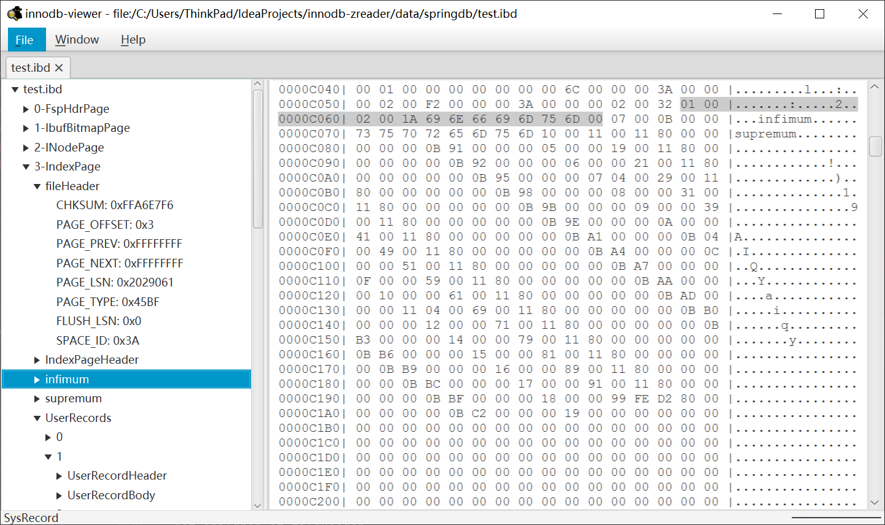
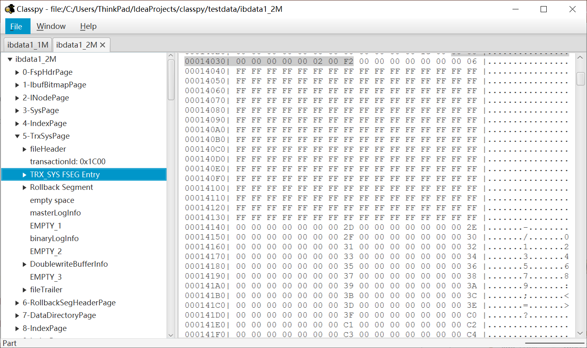
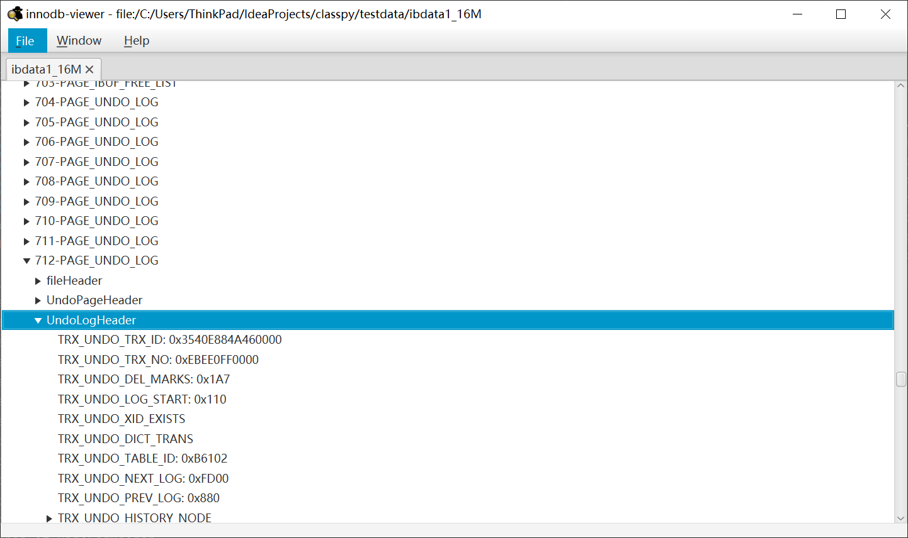

# innodb-viewer
查看ibd(独立表空间)文件、ibdata1(系统表空间)文件的工具。

## 来源
1. 学习innodb时，对表空间、段、区、组、页的关系了解很模糊  
2. 想到了解析class文件的 [classpy](https://github.com/zxh0/classpy) 项目，在此的基础开发了这个小工具

## 功能
1. 独立表空间
   
2. 系统表空间(<=2M)
   
3. 系统表空间(>2M且小于等于16M)
   

## 引用和参考
1. [classpy](https://github.com/zxh0/classpy)
2. [MySQL是怎样运行的：从根儿上理解MySQL](https://book.douban.com/subject/35231266/)
3. [InnoDB Diagrams](https://github.com/jeremycole/innodb_diagrams)
4. [innodb_parser](https://github.com/c-rainstorm/innodb_parser)
5. [淘宝数据库内核月报](http://mysql.taobao.org/monthly/)
